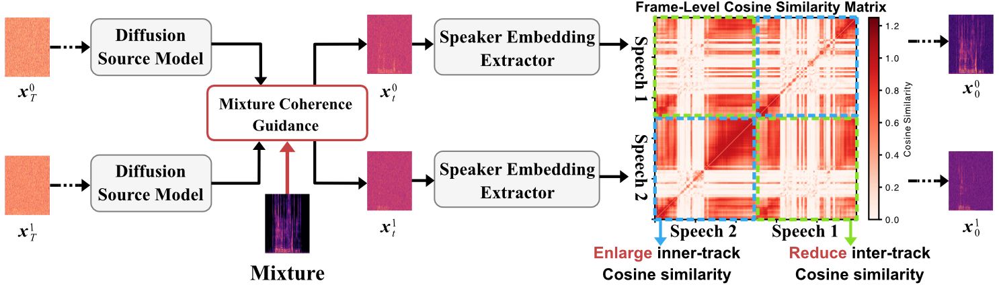

# Unsupervised Single-Channel Speech Separation with a Diffusion Prior under Speaker-Embedding Guidance

<p align="center">  
    
</p>

This repository contains the implementation of the paper "*Unsupervised Single-Channel Speech Separation with a Diffusion Prior under Speaker-Embedding Guidance*".

## Setup
To use this repository, please prepare the code, environment and pretrained checkpoints.

1. Clone this repositrory and prepare the environment 
    ```
    $ git clone https://github.com/RunwuShi/UnSepDiff.git
    $ cd ./UnSepDiff
    $ conda create -n unsepdiff python=3.10
    $ conda activate unsepdiff
    $ pip install -r requirements.txt
    ```


2. Download the diffusion and speaker model checkpoints, and put them in `./checkpoints`.

    Diffusion model: https://drive.google.com/file/d/1NpEZzDiDSwNTHFL8gDCJ1yVaNldPEZ3U/view?usp=drive_link

    Speaker model: https://drive.google.com/file/d/1cNttkLX4Gm_cfy6Pn8fGVirRkScEfp97/view?usp=drive_link


## Inference
1. Run test_vctk.py, parameters can be changed in this file. The speech_samples folder should be organized in a hierarchical speaker/speech structure. 

    ```
    $ python test_vctk.py
    ```


## Reference
- Undiff: https://arxiv.org/abs/2306.00721
- DPS: https://arxiv.org/abs/2209.14687, Github: https://github.com/DPS2022/diffusion-posterior-sampling
- The Dirac sampling method is from https://arxiv.org/abs/2302.02257, Github: https://github.com/gladia-research-group/multi-source-diffusion-models


